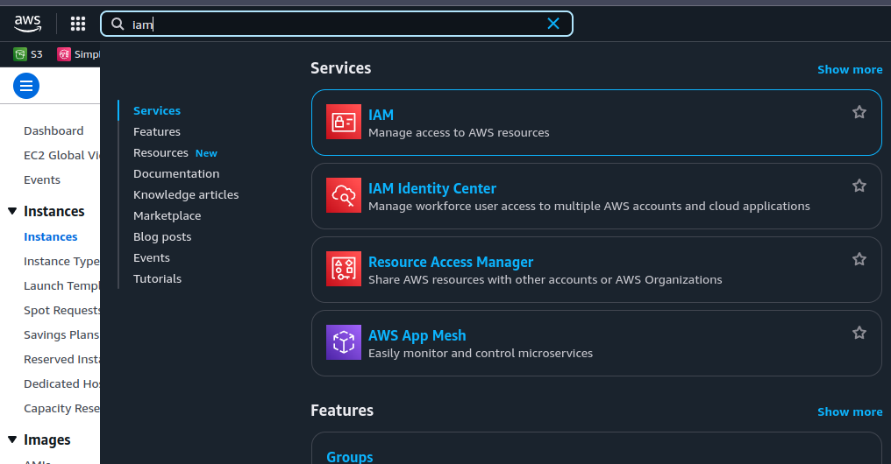
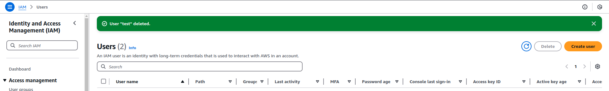
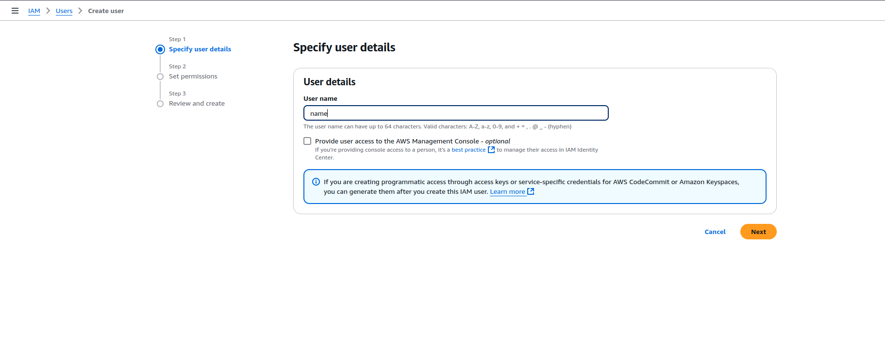
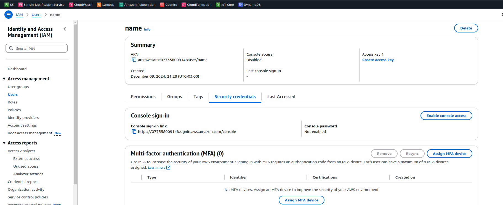
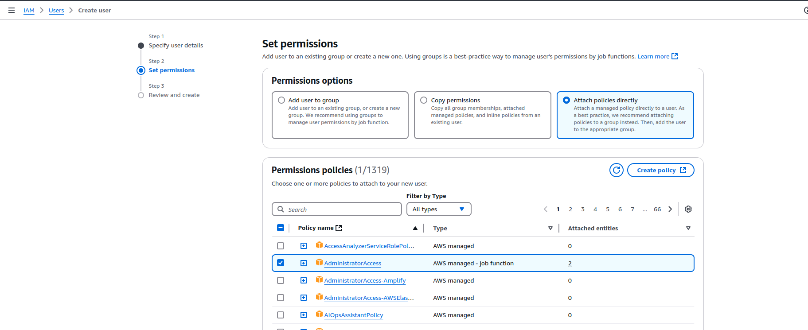
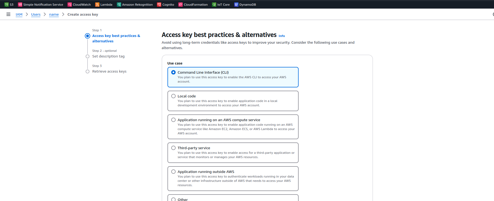
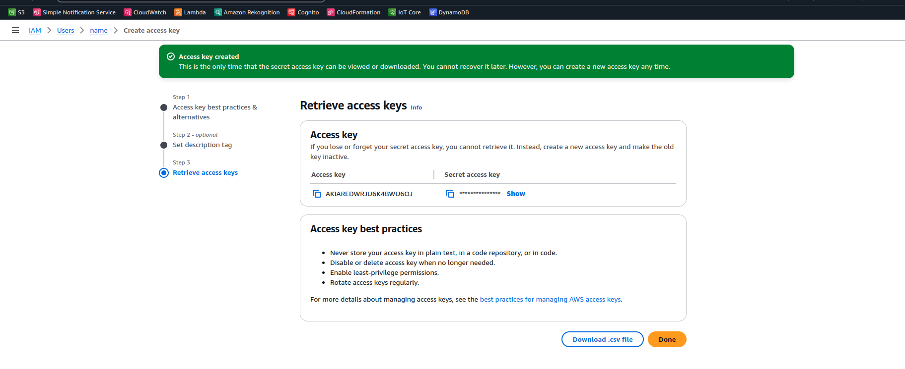

# Criar um IAM User e Configurar `.aws/credentials`

Este guia descreve como criar um usuário IAM na AWS e configurar suas credenciais no arquivo `.aws/credentials`.

## Passo 1: Acesse o IAM no Console AWS

1. No console AWS, procure por "IAM" na barra de busca.  
   

## Passo 2: Acesse a seção de usuários

1. No painel do IAM, clique em **Users**.  
   

## Passo 3: Crie um novo usuário

1. Clique no botão **Add user**.  
   

2. Insira o nome do usuário desejado e selecione as permissões necessárias. Escolha **Programmatic access** para gerar chaves de acesso.  
   

## Passo 4: Anexar políticas de permissão

1. Escolha a política **AdministratorAccess** (ou qualquer outra política que atenda às suas necessidades).  
   

## Passo 5: Criar chaves de acesso

1. Ao finalizar a criação do usuário, clique em **Create access key**.  
   

## Passo 6: Copie as credenciais

1. Copie o **Access Key ID** e **Secret Access Key** exibidos na tela.  
   **Atenção:** Salve essas informações em local seguro.  
   

## Passo 7: Configure o arquivo `.aws/credentials`

1. No terminal ou editor de sua preferência, abra o arquivo `~/.aws/credentials`. Caso ele não exista, crie o arquivo.

2. Adicione as credenciais do usuário no seguinte formato:

   ```ini
   [default]
   aws_access_key_id = SUA_ACCESS_KEY_ID
   aws_secret_access_key = SUA_SECRET_ACCESS_KEY

3. Substitua `SUA_ACCESS_KEY_ID` e `SUA_SECRET_ACCESS_KEY` pelas informações copiadas no Passo 6.

## Passo 8: Teste a configuração

1. No terminal, execute o seguinte comando para verificar se as credenciais estão configuradas corretamente:
```bash
  aws s3 ls
```
 Este comando deve listar os buckets S3 da sua conta AWS. Caso isso não aconteça, revise os passos anteriores e certifique-se de que as credenciais foram configuradas corretamente.

## Passo 9: Conclusão

1. O usuário IAM foi configurado com sucesso! Você pode agora utilizar o AWS CLI para interagir com os serviços AWS.

2. Caso tenha dúvidas ou precise ajustar as permissões, volte ao console do IAM e edite as configurações do usuário criado.